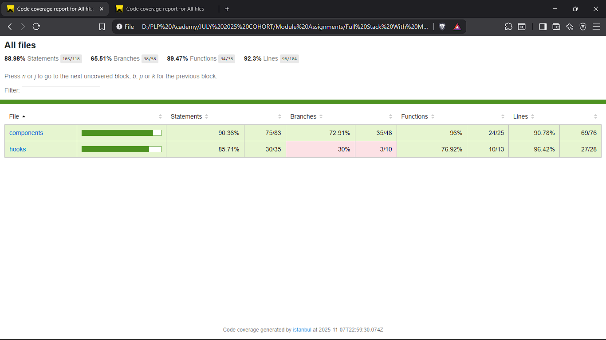
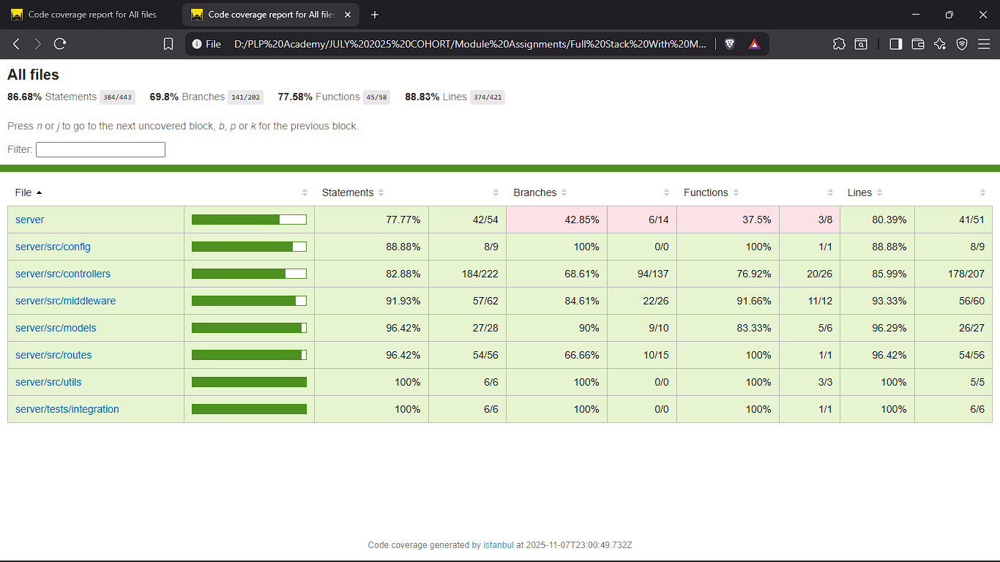
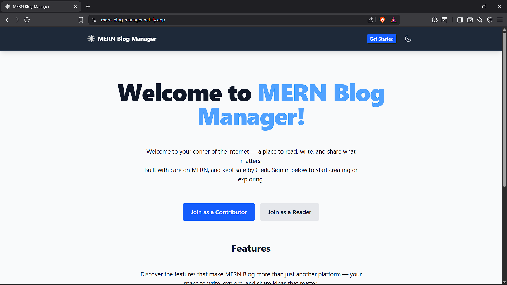
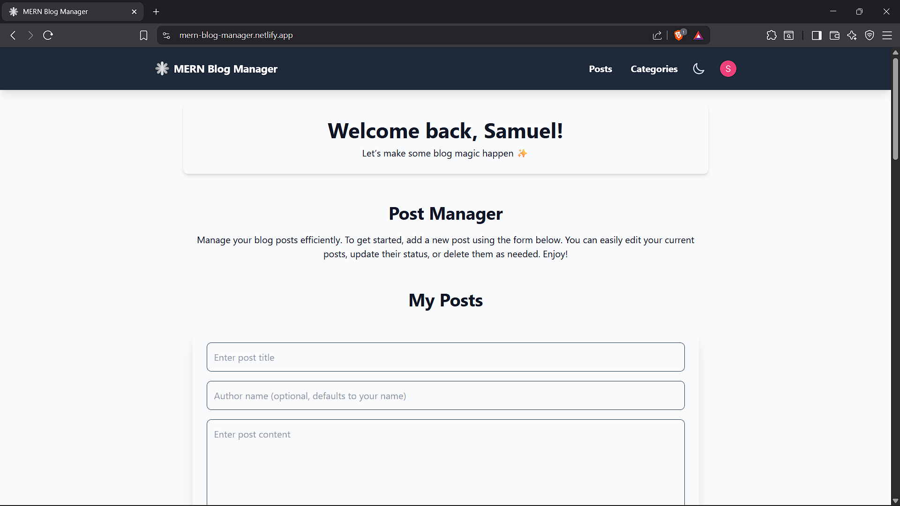
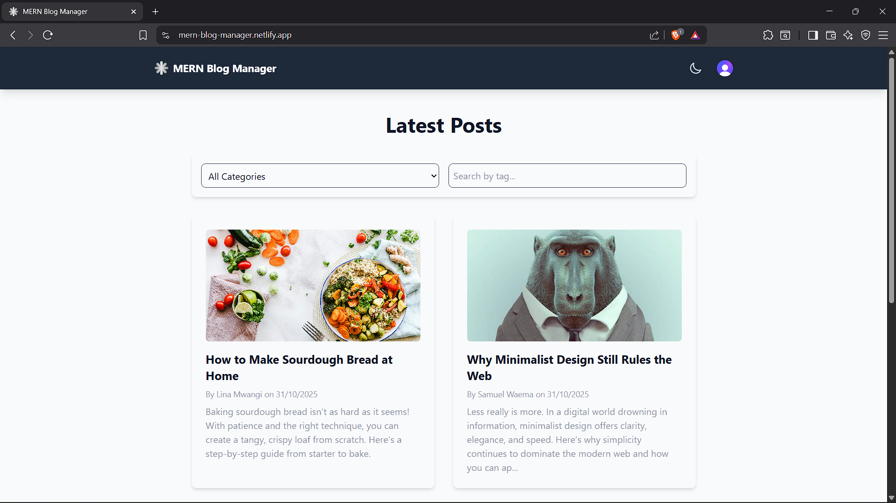
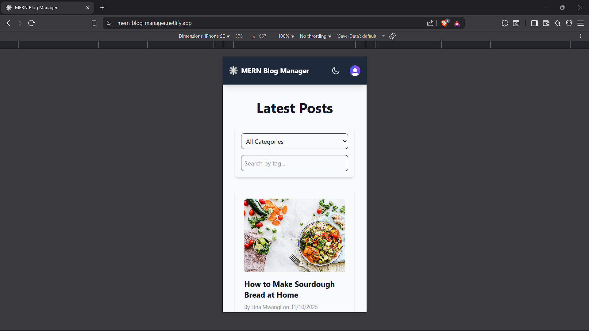

# MERN Blog Manager

A full-stack MERN application for creating, managing, and sharing blog content. It features an interactive dashboard for content management and a clean, public-facing view for individual posts. Built with secure Clerk authentication, a RESTful API backend, and a responsive React frontend styled with Tailwind CSS.

This version also includes a complete testing setup, allowing developers to clone the project and run unit, integration, and end-to-end tests to explore and verify the app’s reliability.

💡 If you notice any areas where test coverage could be improved, feel free to contribute! Expanding and refining the test suite helps strengthen the project’s overall quality and maintainability.

## Features

- **Full CRUD for Posts & Categories**: Create, read, update, and delete posts and their categories through a sleek admin dashboard.
- **Role-Based Authentication**: Secure user management with [Clerk](https://clerk.com/), featuring distinct roles for 'Editors' (content creators) and 'Viewers' (readers/commenters).
- **Content Ownership**: Editors have full control over their own posts and categories, which are cloned from system templates, ensuring content isolation.
- **Featured Image Uploads**: Upload and manage featured images for your blog posts using `multer`.
- **Unique View Count**: Posts track unique views from 'Viewers' over a 24-hour period, providing more accurate engagement metrics.
- **Comments System**: Logged-in users can comment on posts, with ownership rules allowing them to edit or delete their own comments.
- **Server-Side Validation**: Robust backend validation with `express-validator` to maintain data integrity.
- **Dark/Light Mode**: Built-in theme switching powered by React Context.
- **Pagination**: Smooth navigation even for large datasets of posts and categories.
- **Searching and Filtering**: Public post list includes dynamic filtering by category and searching by tags.

## Tech Stack

- **Frontend**: React, Vite, Tailwind CSS, React Router  
- **Backend**: Node.js, Express.js  
- **Database**: MongoDB with Mongoose  
- **Authentication**: Clerk  
- **API Communication**: Axios  
- **File Uploads**: Multer  

## Screenshots

### 🧪 Testing Strategy

This project employs a multi-layered testing strategy to ensure reliability, maintainability, and confidence in the codebase. The strategy is broken down into four key areas, each targeting a different level of the application stack.

#### 1. Unit Testing

-   **Objective**: To verify that individual functions, components, and hooks work correctly in isolation.
-   **Tools**: [Jest](https://jestjs.io/) is used as the test runner for both the client and server. [React Testing Library](https://testing-library.com/docs/react-testing-library/intro/) is used for testing React components.
-   **Client-Side**: Unit tests cover individual React components (e.g., `Button.test.jsx`), custom hooks (e.g., `usePosts.test.js`), and utility functions. Components are rendered in a virtual DOM, and their behavior is asserted without needing a browser.
-   **Server-Side**: Unit tests cover utility functions (e.g., `slugify` in `utils.test.js`) and individual middleware functions (e.g., `validationMiddleware.test.js`) in isolation, using mocks for `req`, `res`, and `next`.

#### 2. Integration Testing

-   **Objective**: To test how multiple parts of the application work together.
-   **Tools**: Supertest is used for server-side API testing, and React Testing Library is used for client-side component integration.
-   **Client-Side**: Components that fetch data (e.g., `PublicPostList.test.jsx`) are tested by mocking the API services (`postService`, `categoryService`) to ensure they handle loading, success, and error states correctly.
-   **Server-Side**: API endpoints are tested by making real HTTP requests to the Express server. These tests (e.g., `posts.test.js`, `categories.test.js`) use an in-memory MongoDB database (`mongodb-memory-server`) to ensure a clean, isolated environment for each test run, verifying database operations, authentication, and validation logic.

#### 3. End-to-End (E2E) Testing

-   **Objective**: To simulate real user workflows from start to finish, ensuring the entire application functions as a cohesive whole.
-   **Tools**: Cypress is used to automate browser interactions.
-   **Coverage**: E2E tests cover critical user flows such as logging in as different user roles (`auth.cy.js`), creating/editing/deleting posts and categories (`post-crud.cy.js`, `category-management.cy.js`), and adding/deleting comments (`comment-crud.cy.js`). API requests are intercepted and mocked to ensure fast, reliable, and deterministic tests.

#### 4. Visual Regression Testing

-   **Objective**: To catch unintended visual changes in the UI that functional tests might miss.
-   **Tools**: The `cypress-image-snapshot` plugin is integrated with Cypress.
-   **Process**: A baseline snapshot of key components (like the `PublicPostList` in `auth.cy.js`) is captured. On subsequent test runs, new snapshots are taken and compared pixel-by-pixel to the baseline. The test fails if there are any visual discrepancies, preventing accidental UI bugs.

### Test Coverage

The project aims for high code coverage across both the client and server, with a target of at least 70% as per the assignment requirements.

| Client Coverage Report | Server Coverage Report |
|:----------------------:|:----------------------:|
|  |  |

---

| Public Homepage View | Editor Dashboard View |
|:--------------------:|:---------------------:|
|  |  |

| Reader View (Latest Posts) | Mobile Responsive View |
|:--------------------------:|:----------------------:|
|  |  |

## Project Structure

```
mern-blog-manager/
├── client/                      # React front-end
│   ├── public/                  # Static files
│   ├── cypress/                 # E2E and Visual Regression tests
│   ├── src/                     # React source code
│   │   ├── assets/              # Logo file directory
│   │   ├── components/          # Reusable components
│   │   ├── context/             # React context providers
│   │   ├── hooks/               # Custom React hooks
│   │   ├── pages/               # Page components
│   │   ├── services/            # API services
│   │   ├── tests/               # Jest tests (Unit & Integration)
│   │   ├── utils/               # Frontend utility functions
│   │   └── App.jsx              # Main application component
│   ├── package.json             # Client dependencies
│   └── vite.config.js           # Vite configuration

├── server/                      # Express.js back-end
│   ├── __mocks__/               # Manual mocks for external libraries
│   ├── src/                     # Server source code
│   │   ├── config/              # Configuration files
│   │   ├── controllers/         # Route controllers
│   │   ├── middleware/          # Custom middleware
│   │   ├── models/              # Mongoose models
│   │   ├── routes/              # API routes
│   │   └── utils/               # Backend utility functions
│   ├── tests/                   # Jest tests (Unit & Integration)
│   ├── uploads/                 # File uploads directory
│   ├── server.js                # Main server file
│   └── package.json             # Server dependencies
├── docs/                        # Documentation & reporting
│   └── coverage/                # Test coverage report screenshots
|
├── jest.config.js               # Root Jest configuration for monorepo
└── README.md                    # Project documentation

```

## Getting Started & Setup

### Prerequisites
- Node.js (v18 or higher)
- MongoDB (local installation or MongoDB Atlas)
- Clerk account for authentication keys
- [ngrok](https://ngrok.com/download) for handling webhooks in local development

### 1. Clone the Repository
First, clone the project to your local machine.

```bash
git clone https://github.com/PLP-MERN-Stack-Development/testing-and-debugging-ensuring-mern-app-reliability-masmunge95.git
cd <'mern-blog-manager-directory'>
```

### 2. Backend Setup
Navigate to the server directory and install the required dependencies.

```bash
cd server
npm install
```

Next, create a `.env` file in the `server` directory by copying the `server/.env.example` file and adding your configuration values.

```ini
# server/.env
NODE_ENV=development
PORT=5000
MONGO_URI="your_mongodb_connection_string"
CLERK_SECRET_KEY="your_clerk_secret_key_starting_with_sk_..."
CLERK_WEBHOOK_SECRET_LOCAL="your_local_webhook_secret_starting_with_whsec_..."
CLERK_WEBHOOK_SECRET_PUBLISHED="your_production_webhook_secret_starting_with_whsec_..."
```

### 3. Frontend Setup
In a new terminal, navigate to the client directory and install its dependencies.

```bash
cd client
npm install
```

Then, create a `.env` file in the client directory by copying the `client/.env.example` file and add your configuration values.

```ini
# client/.env
VITE_API_URL="your_production_backend_url"
VITE_CLERK_PUBLISHABLE_KEY="your_clerk_publishable_key_starting_with_pk_..."
```

For running the Cypress E2E tests, you will also need to create a cypress.env.json file inside the client directory. Copy the client/cypress.env.json.example file and add your test user credentials from your Clerk dashboard. These should be separate accounts from your regular admin user.

```json 
"CLERK_TEST_USER_EMAIL": "your_editor_test_user_email",
"CLERK_TEST_USER_PASSWORD": "your_test_user_password",
"CLERK_TEST_VIEWER_EMAIL": "your_viewer_test_user_email",
"CLERK_TEST_VIEWER_PASSWORD": "your_test_user_password" 
```

### 4. Clerk Configuration
1. **API Keys**: In your Clerk Dashboard, go to *API Keys* and copy your Publishable key and Secret key into the respective `.env` files.  
2. **JWT Template**: Go to *JWT Templates*, create a new template named `Metadata-claims`, and add a new claim with:

```bash
   {
	"metadata": "{{user.public_metadata}}"
   }
```

   Set this template as the default.  
3. **Webhooks**:  
   - **Production**: Set the URL to `https://<your-backend-url>/api/webhooks/clerk`. Subscribe to the `user.created` event. Copy the signing secret to `CLERK_WEBHOOK_SECRET_PUBLISHED`.  
   - **Local Development**: Run `ngrok http 5000` and use the public URL it provides (e.g., `https://<random-string>.ngrok-free.app/api/webhooks/clerk`). Subscribe to `user.created` and copy the secret to `CLERK_WEBHOOK_SECRET_LOCAL`.

### 5. Run the Application
You will need two separate terminal windows to run both the client and server concurrently.

**Terminal 1 (Backend):**
```bash
cd server
npm start
```

**Terminal 2 (Frontend):**
```bash
cd client
npm run dev
```

The application will be available at [http://localhost:5173](http://localhost:5173).  
For local webhook testing, you will also need a third terminal running `ngrok http 5000`.

### 6. Deploy to Netlify
To deploy the frontend of this application, you will use Netlify. Since you won't have permissions to connect the original classroom repository, you must first create your own fork.

1.  **Fork the Repository**: Go to the main repository page on GitHub and click the "Fork" button to create a copy under your own account.
2.  **Create a New Netlify Site**: Log in to your Netlify account and click "Add new site" > "Import an existing project".
3.  **Connect to GitHub**: Choose GitHub and authorize Netlify to access your repositories. Select the fork you just created.
4.  **Configure Build Settings**: Configure the site with the following settings to ensure it builds correctly:
    -   **Base directory**: `client`
    -   **Build command**: `npm run build`
    -   **Publish directory**: `client/dist`
5.  **Add Environment Variables**: Before deploying, go to **Site configuration > Environment variables** and add the following:
    -   `VITE_API_URL`: The URL of your deployed backend (e.g., from Render).
    -   `VITE_CLERK_PUBLISHABLE_KEY`: Your Clerk publishable key.
    -   `NPM_FLAGS`: Set the value to `--legacy-peer-deps`. This is crucial to prevent build failures due to peer dependency conflicts.
6.  **Deploy Site**: Click "Deploy site". Netlify will start the build process and deploy your frontend.

### 7. Deploy to Render (Backend)
To deploy the backend, you can use a service like Render.

1.  **Create a New Web Service**: In your Render dashboard, click "New +" and select "Web Service".
2.  **Connect Repository**: Connect the GitHub repository fork you created.
3.  **Configure Settings**: Fill in the details for your service:
    -   **Name**: Give your service a name (e.g., `mern-blog-backend`).
    -   **Root Directory**: `server`
    -   **Build Command**: `npm install`
    -   **Start Command**: `npm start`
    -   **Node Version**: Select 18 or later.
4.  **Add Environment Variables**: Go to the "Environment" tab and add the following variables. **This is a critical step.**
    -   `MONGO_URI`: Your MongoDB connection string.
    -   `CLERK_SECRET_KEY`: Your Clerk Secret Key (starts with `sk_...`).
    -   `CLERK_WEBHOOK_SECRET_PUBLISHED`: Your production webhook signing secret from the Clerk dashboard.
    -   `NODE_ENV`: Set this to `production`.

5.  **Create Web Service**: Click "Create Web Service". Render will build and deploy your backend.
6.  **Update URLs**:
    -   Once deployed, copy the new backend URL and update the `VITE_API_URL` environment variable in your Netlify site settings.
    -   Update your production webhook endpoint in the Clerk dashboard to point to your new Render URL (e.g., `https://<your-render-url>/api/webhooks/clerk`).

### 8. Running Tests
This project is equipped with a comprehensive test suite. To run the tests, navigate to the appropriate directory (`client` or `server`) and use the following npm scripts:

**Server-Side Tests (from the `server` directory):**
```bash
# Run all server unit and integration tests
npm test

# Run only unit tests
npm run test:unit

# Run only integration tests
npm run test:integration

# Generate a coverage report
npm run test:coverage
```

**Client-Side Tests (from the `client` directory):**
```bash
# Run all client unit and integration tests
npm test

# Run only unit tests
npm run test:unit

# Run only integration tests
npm run test:integration

# Generate a coverage report
npm run test:coverage

# Open the Cypress Test Runner UI for E2E tests
npm run cypress:open

# Run all Cypress E2E tests headlessly
npm run cypress:run
```

## Debugging and Reliability

Several features have been implemented to ensure the application is robust, debuggable, and performant.

### 1. Server-Side Reliability
-   **Global Error Handler**: A global error-handling middleware (`errorHandler.js`) catches all unhandled errors from the API routes. It formats errors into a consistent JSON response and prevents sensitive stack traces from being exposed in production.
-   **Request Logging**: The `logger.js` middleware logs every incoming API request to the console, providing a clear audit trail for debugging.
-   **Performance Monitoring**: The `performanceMonitor.js` middleware measures and logs the response time for every API request, making it easy to identify and troubleshoot slow endpoints.

### 2. Client-Side Reliability
-   **Error Boundaries**: The React application uses a custom `ErrorBoundary` component to wrap major UI sections (e.g., `PostManager`, `CategoryManager`, and page layouts). This prevents a JavaScript error in one part of the UI from crashing the entire application, instead displaying a user-friendly fallback message.

### 3. Performance Optimization
-   **Client-Side Memoization**: To prevent unnecessary re-renders and improve UI responsiveness, presentational components that are part of a list (e.g., `PublicPostCard`, `PostCard`, `CategoryCard`) and common reusable components (e.g., `Button`) are wrapped in `React.memo`. This ensures they only re-render when their props have actually changed.
-   **Database Query Optimization**: The backend controllers are designed to fetch data efficiently. For example, the public post list uses a single query with `$in` to fetch posts across multiple related categories, reducing database round-trips.

---

## API Documentation

| Method   | Endpoint                       | Description                                      | Access        |
|----------|--------------------------------|--------------------------------------------------|---------------|
| `GET`    | `/api/posts`                   | Get posts (published for public, all for editor) | Public/Editor |
| `POST`   | `/api/posts`                   | Create a new blog post                           | Editor        |
| `GET`    | `/api/posts/:id`               | Get a single post (public)                       | Public        |
| `GET`    | `/api/posts/authenticated/:id` | Get a single post (for logged-in users)          | Viewer/Editor |
| `PUT`    | `/api/posts/:id`               | Update a blog post by ID                         | Owner         |
| `PATCH`  | `/api/posts/:id/status`        | Update a post's status (draft, published, etc.)  | Owner         |
| `DELETE` | `/api/posts/:id`               | Delete a blog post by ID                         | Owner         |
| `POST`   | `/api/posts/:id/comments`      | Add a comment to a post                          | Viewer/Editor |
| `PUT`    | `/api/posts/:id/comments/:cid` | Update a user's own comment                      | Owner         |
| `DELETE` | `/api/posts/:id/comments/:cid` | Delete a user's own comment                      | Owner         |
| `GET`    | `/api/categories`              | Get categories (public or user-specific)         | Public/Editor |
| `POST`   | `/api/categories`              | Create a new category                            | Editor        |
| `PUT`    | `/api/categories/:id`          | Update a category by ID (copy-on-edit)           | Owner         |
| `DELETE` | `/api/categories/:id`          | Delete a category by ID                          | Owner         |

## Troubleshooting

1. **Installation Fails Due to Peer Dependencies**
   - **Issue:** Running `npm install` in either the `client` or `server` directory fails with errors related to `ERESOLVE` or peer dependency conflicts.
   - **Fix:** This can happen with newer versions of npm that enforce stricter peer dependency rules. To bypass this, use the `--legacy-peer-deps` flag during installation:
     ```bash
     npm install --legacy-peer-deps
     ```

2. **Module Not Found Errors (Client)**  
   - **Issue:** Errors like `Failed to resolve import 'axios'` or missing dependencies.  
   - **Fix:** Run `npm install` in the `client` directory. Ensure packages such as `axios`, `react-router-dom`, and `prop-types` are installed.

3. **Incorrect Import Paths**  
   - **Issue:** Components fail to load due to misreferenced paths.  
   - **Fix:** A `@` alias was added in `vite.config.js` to reference the `src` directory for cleaner imports, e.g. `import Component from '@/components/Component'`.

4. **API 404 Errors in Development**  
   - **Issue:** Frontend requests to `/api/...` return 404.  
   - **Fix:** A proxy in `vite.config.js` forwards `/api` and `/uploads` requests to the backend server running on `http://localhost:5000`.

5. **500 Error on Deployed Backend (Render)**
   - **Issue:** The deployed backend returns a 500 Internal Server Error, and logs show "Missing Clerk Secret Key".
   - **Fix:** This means the `CLERK_SECRET_KEY` environment variable is missing or incorrect in your Render service. Go to your service's "Environment" tab in the Render dashboard and ensure the `CLERK_SECRET_KEY` is set correctly. It should be the key from your Clerk dashboard that starts with `sk_...`.

---

**Happy coding and blogging! 🚀**
